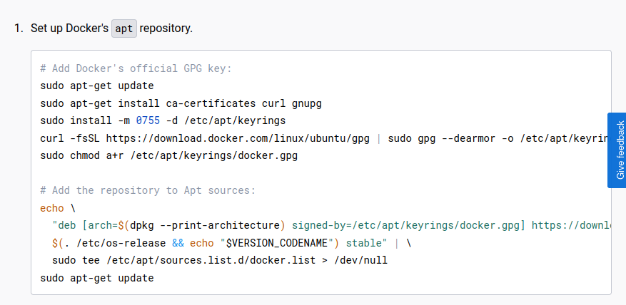
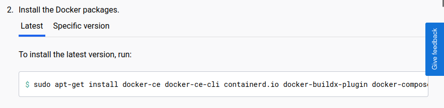
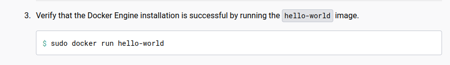
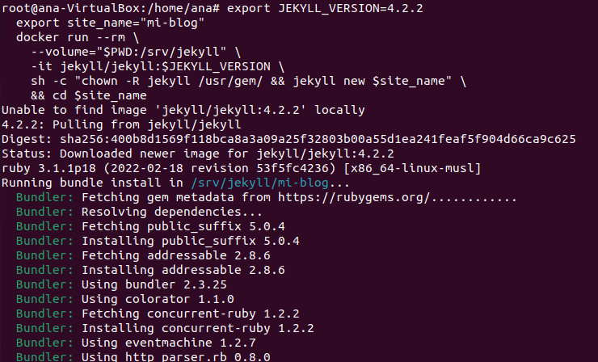
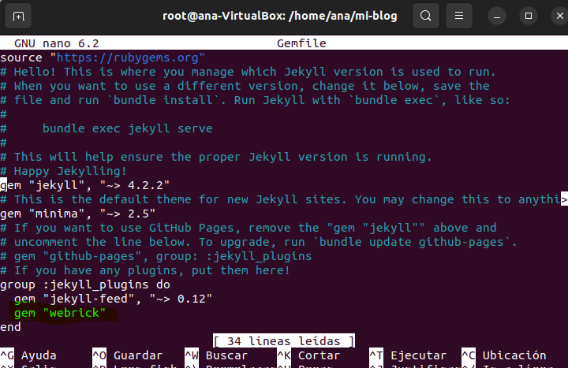

Instalación utilizando la imagen Docker

lo primero que hacemos es instalar el docker.

Iniciamos el Docker con el siguiente comando:

  

     $ systemctl start docker.service

Con los siguientes comandos procederemos a la instalación de dockers.

Con la siguiente instrucción, creamos  mi blog. Esta orden realizará las siguientes acciones:

  Descargará la versión de la imagen Jekyll si aún no está disponible.
 Creará el contenedor "mi-blog" basado en dicha imagen.
 Montará el directorio local actual en el directorio /srv/jekyll del contenedor.
Ejecutará en el contenedor el comando jekyll new mi-blog, creando así un nuevo proyecto Jekyll en la carpeta ./mi-blog/.

Utilizamos el parámetro --rm para indicar que el contenedor se limpiará después de completar la orden. El parámetro -it permite abrir un seudo-TTY con stdin, posibilitando la ejecución de comandos mientras el contenedor está en ejecución.

    $ export JEKYLL_VERSION=4.2.2
      export site_name="mi-blog"
     docker run --rm \
    --volume="$PWD:/srv/jekyll" \
    -it jekyll/jekyll:$JEKYLL_VERSION \
    sh -c "chown -R jekyll /usr/gem/ && jekyll new $site_name" \
    && cd $site_name

Al completar este proceso,iniciamos el contenedor y creamos los archivos del proyecto en la carpeta ./mi-blog/, los cuales pueden leerse, modificarse o agregarse.

Para construir el sitio web, ejecuta la siguiente instrucción:

    $ docker run --rm --volume="$PWD:/srv/jekyll" -it jekyll/jekyll:$JEKYLL_VERSION jekyll build

Una vez construido el sitio, alojado en la carpeta _site,levantamos el servidor para comprobar su funcionamiento.

Si aparece un error al iniciar el servidor añade la siguiente línea en el archivo Gemfile: gem 'webrick'

    $ docker run --name $site_name --volume="$PWD:/srv/jekyll" -p 3000:4000 -it jekyll/jekyll:$JEKYLL_VERSION jekyll serve --watch --drafts

Para visualizar la página web, abrimos en un navegador la dirección http://localhost:3000/. Cualquier modificación realizada en los archivos se reflejará en el navegador al actualizar la página.

Después de la creación del contenedor, este puede iniciarse y detenerse con las siguientes instrucciones:

Para abrir la carpeta del proyecto usamos el siguiente comando:

    $ cd ~/proyectos-web/mi-blog

    Inicia el contenedor.

    $ docker container start mi-blog

Para detener el docker usamos :

    $ docker container stop mi-blog

Una vez construido el sitio (alojado en la carpeta _site), podremos levantar el servidor para comprobar su funcionamiento.

Tambien deberemos añadir al fichero GEMFILE la gema de webrick para que funcione correctamente.

